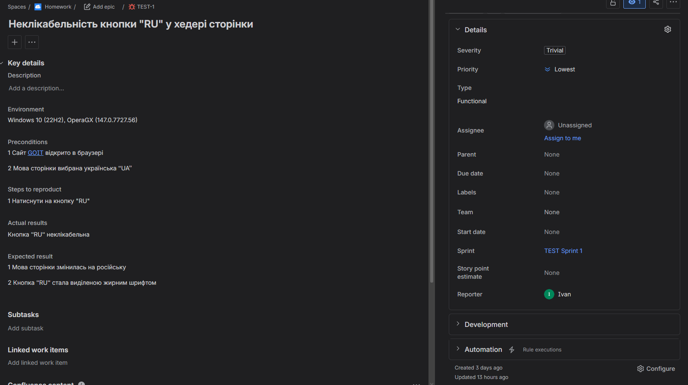
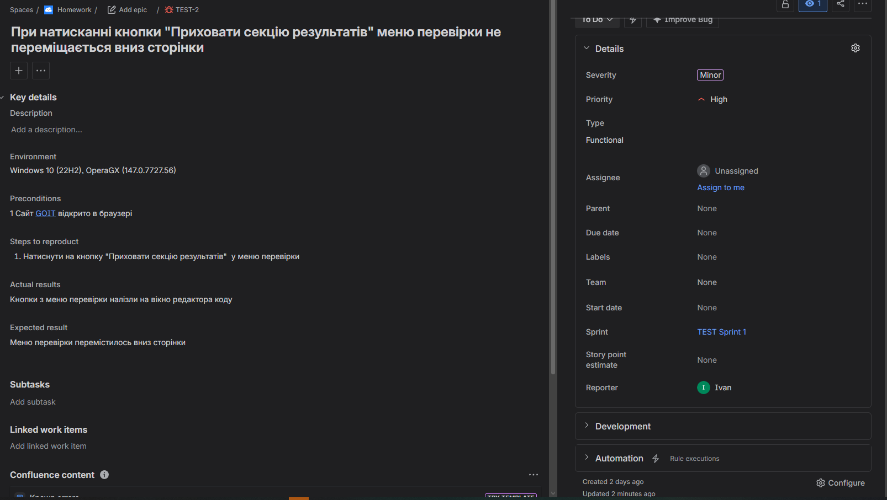
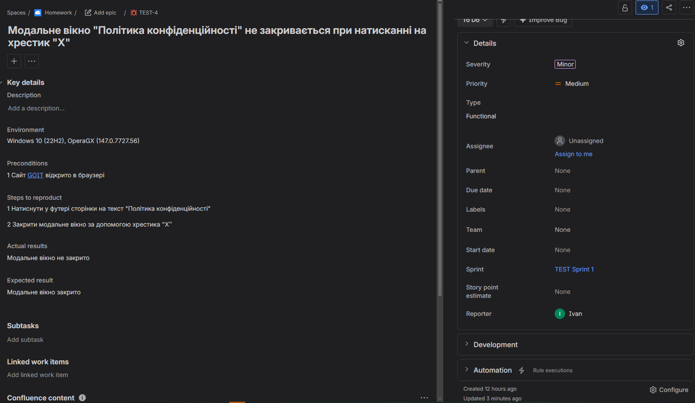
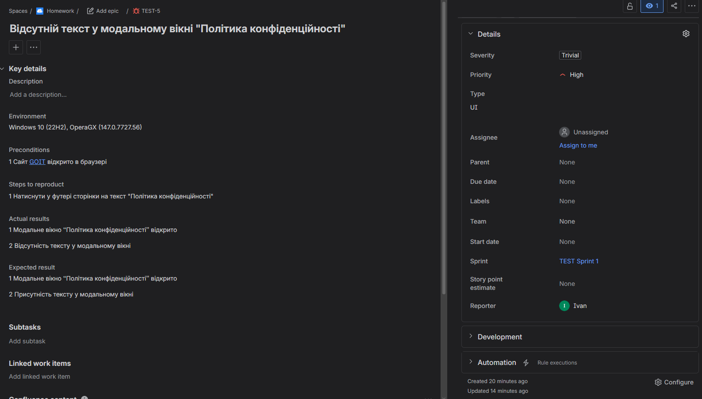
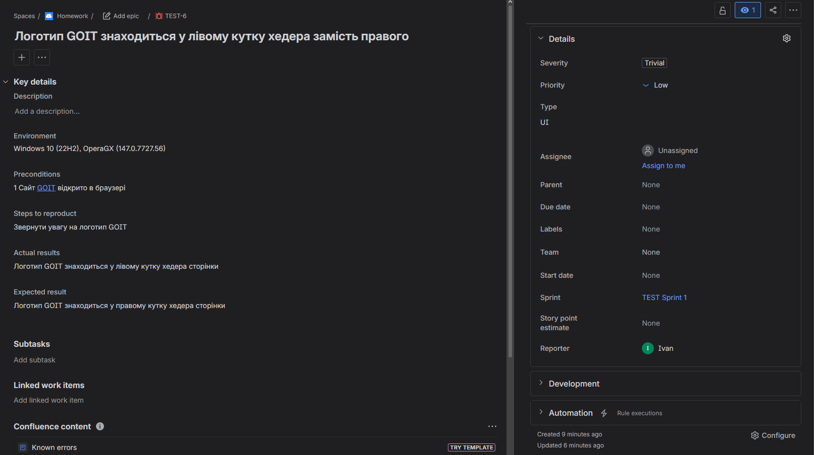

# 👨‍💻 Junior QA Engineer Portfolio | Ivan Poloziuk

Welcome to my QA Portfolio! I am a Junior QA Engineer with practical experience in manual web and mobile testing. This repository contains examples of my test documentation, bug reports, and practical QA tasks.

---

## 🛠 Technical Skills
- **Testing Types:** Functional, UI/UX, Usability, Sanity, Regression, Positive/Negative Testing.
- **Documentation:** Test Cases, Checklists, Bug Reports, Test Plans.
- **Tools & Technologies:** Jira, TestRail, Postman, SQL, Chrome DevTools, Git/GitHub.

---

## 📁 Portfolio Artifacts

### 1. Bug Tracking & Defect Reporting 🐛
Structured and detailed bug reports capturing environments, preconditions, steps to reproduce, and expected/actual results.
* 📊 **Excel Bug Reports:** [Завантажити .xlsx](./manual/Bug_Reports.xlsx?raw=true) | [👁️ Переглянути в Google Sheets](https://docs.google.com/spreadsheets/d/11sxyu8NWlSjfkujTyPl0mOysRSp0JIgY/edit?usp=sharing&ouid=108610375694020017401&rtpof=true&sd=true)
* 📌 **Jira Bug Tickets**: Practical examples of defect reporting in Jira (GoIT platform testing).

<b>📸 Click to expand Jira Screenshots</b>

 

<i>Bug 1: Non-clickable "RU" language button</i> 
  

<i>Bug 2: Review menu layout issue overlapping with code editor</i> 
  

<i>Bug 3: "Privacy Policy" modal window close button failure</i> 
  

<i>Bug 4: Missing text content inside the "Privacy Policy" modal</i> 
  

<i>Bug 5: UI defect - GoIT logo positioned incorrectly in the header</i> 

### 2. Test Design & Documentation 📝
Comprehensive test design artifacts covering core functionality, edge cases, and UI verification.
* 📄 **Test Cases in TestRail (PDF):** [Завантажити .pdf](./manual/testrail.pdf?raw=true)
* 📊 **Positive/Negative Test Cases & Checklist:** [Завантажити .xlsx](./manual/Pos_Neg_CL.xlsx?raw=true) | [👁️ Переглянути в Google Sheets](https://docs.google.com/spreadsheets/d/1-nPvGy-C_sWo8XQjXhrOzYklqiVFOAkr/edit?usp=sharing&ouid=108610375694020017401&rtpof=true&sd=true)

### 3. API Testing 🚀
REST API verification including endpoint testing, request/response structure validation, and HTTP status code checks.
* 📊 **API Test Cases & Postman Documentation:** [Завантажити .xlsx](./api/Postman.xlsx?raw=true) | [👁️ Переглянути в Google Sheets](https://docs.google.com/spreadsheets/d/1DjyFfxhiwE28G5Fb421YagQr0OM_k2kB/edit?usp=sharing&ouid=108610375694020017401&rtpof=true&sd=true)

### 4. Database & SQL Testing 🗄️
Database verification, data integrity checks, and complex SQL query execution.
* 📊 **SQL Testing Tasks & Queries:** [Завантажити .xlsx](./sql/SQL.xlsx?raw=true) | [👁️ Переглянути в Google Sheets](https://docs.google.com/spreadsheets/d/1YUx5ijijPT81JuEO9ywbrNkBstarFmPS/edit?usp=sharing&ouid=108610375694020017401&rtpof=true&sd=true)

---

## 📬 Contacts
- **LinkedIn:** [Ivan Poloziuk](https://www.linkedin.com/in/ivan-poloziuk/?locale=uk)
- **Telegram:** [@vandzhes](https://t.me/vandzhes)
- **Email:** ivanpoloz2005@gmail.com
